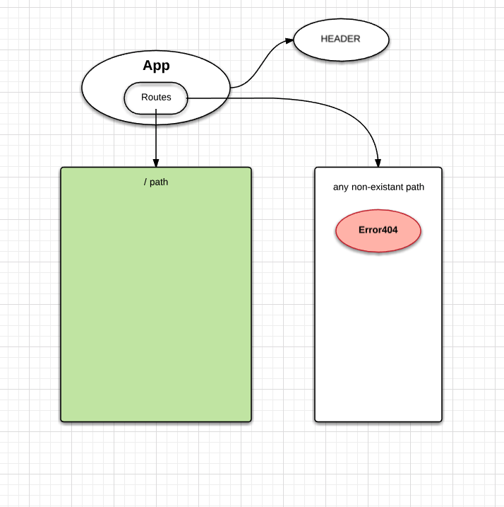

# Tap Room Makeover

#### By Adrian Messado
[Adrian Messado](https://github.com/adrianmess)

## Description

### Component Structure

## User Story

## Specifications

#### Pre-requisites

### NPM & Node Installation
* Install Node.js
  * https://www.npmjs.com/get-npm

  * Install
### Clone
  * Clone this repo to your local machine from: https://github.com/adrianmess/adrians-react-tap-rooom

        $ git clone https://github.com/adrianmess/adrians-react-tap-rooom

Open **adrians-react-tap-room** folder from terminal.

### NPM Installation
      $ npm install

## Start Development server

## Known Bugs
  * No known bugs at this time.

## Technologies Used

* HTML
* CSS
* JavaScript
* React
* Node.js
* Webpack
* ESLint
* Babel

## License

* GPL

Adrian Messado © 2018
